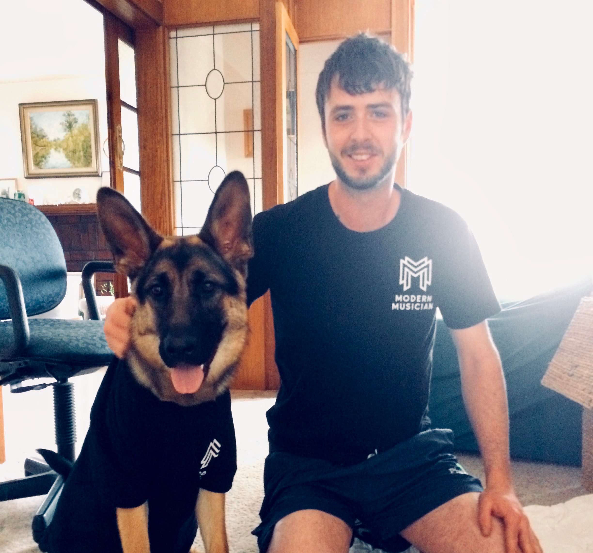

# Hi There! Welcome To My Profile

# Personal Information

Alexander Yeo 
Student number s3795259 
Email Address: s3795259@rmit.edu.au

My name is Alex and I was born and raised in Australia. Upon completing school I’ve tried my hand at a number of things, most notably completing a Certificate III in Baking and pursing a career in Aquaculture. I’m also an avid home recording enthusiast, multi-instrumentalist and dog lover! 

# Interest in IT

**What is your interest in IT? When did your interest in IT start? Was there a particular event or person that sparked your interest? Outline your IT experience (if any).**

I have always been fascinated with technology, and I always find myself amazed seeing or reading about the latest cutting edge developments in various areas of IT. I really began to delve deeper in the world of IT when I decided I wanted to set up a home recording studio . The more I learned about the various tools used in audio production (digital audio workstations, digital amplifier modelling etc.), the more I became fascinated by the wonders of IT. It has also recently became a goal of mine to learn how to build websites or develop app’s and software. 

**Why did you choose to come to RMIT?**

I chose to study at RMIT because of its’ reputation as an excellent place to learn about IT. The option of studying online that RMIT provides, really impacted on my decision to come here also. The flexibility of learning online through RMIT means I can work to support myself more easily and also choose my own hours of study. 

**What do you expect to learn during your studies?**

I hope to gain a fundamental understanding what Information Technology is. I want learn about all the various sectors of the industry, the history of the industry and where it’s likely to be heading in the future. I’m also interested to learn about some of the challenges, problems and ethical implications surrounding the use of IT in certain applications. Ultimately, I’d like to find out what areas of IT I’m drawn to, and learn how to make a contribution to that area. 

# Ideal Job

**Developer Technology Engineer – Medical**

https://www.indeed.com/viewjob?jk=7f0001f4b8d9c115&tk=1d5073ilb1s7i003&from=serp&vjs=3

This is an advertisement for a software development position in the medical industry. It is appealing to me because it seems like a position that requires have both creative thinking and problem solving skills. It also appeals to me because it is a job that is in the medical sector. I would like to make a contribution to the medical field because I want to help improve peoples quality of life.

Candidates need to have a post-graduate degree (masters, Ph.D) in computer science or computer engineering as well as at least 5 years of experience in software development. 
Computer graphics programming experience and experience in developing applications using specific programming languages is also required. Familiarity with Deep Learning theory and excellent soft skills are needed as well. 

Beyond basic computer skills, I am just starting out in the IT world and undergoing my Bachelor of Information Technology marks my first step towards gaining the skills, experience and knowledge I would need in order to meet the requirements for this job.  
I plan to complete my Bachelor in Information Technology, choosing elective subjects pertaining to this particular field of expertise. Upon completion of my Bachelors degree I would then undergo a masters degree and further develop and advance my skillset. 

# Personal Profile

**Personality Test**

https://www.16personalities.com/infj-personality

**Learning Style Test**

http://www.educationplanner.org/students/self-assessments/learning-styles-quiz.shtml?event=results&A=4&V=10&T=6

**Career Aptitude Test**

https://www.123test.com/career-test/id=VL2PEIYXWCDJ&version=

These tests were quite interesting. I think I certainly gained a deeper understanding of who I am, how I learn and what kinds of careers I am best suited for. I don’t hold a lot of personality tests in high regard, but they are owed a certain amount of merit. I feel that I gained the most benefit from the learning style test as I was able to pickup some great tips on what to do if you’re visual learner.  

I know that I am a visual learner so maybe I would be more drawn to express my ideas/work visually. Due to my personality type I feel that I can be sensitive to criticism and perfectionistic in my approach to completing tasks. I am also prone to burning out easily so I may be very diligent in my efforts to complete work especially in a team. My career aptitude test states that I’m highly investigative so I may be prone thinking about issues rather than being outspoken about them. 

If I was forming a team to complete group work, I would look for individuals to work with who would compliment my skill set/personality type. I would be aware of my strengths and weaknesses and look for individuals who can fill in the gaps. In this way, the group would be strong, robust and well-rounded.

# Project Idea

**Overview**

I have an idea for mobile application that would essentially be a visual labeller/translator. This would allow you the user to easily translate something simply by photographing the object. In addition to receiving a translation in your chosen language, you would also receive some suggested questions or phrases associated with the object for you to use if you choose to do so. Furthermore, you could use also use this app like a portable visitor information centre by taking a photo of a building/landmark and receiving information about the subject of interest and what you can do there. 

**Motivation**

Having travelled internationally I know that it can be daunting not speaking the language of the locals. Similarly it can be a struggle getting around, knowing where you are and where it is that you want to go. Sometimes, when travelling to a destination, you’re not sure if you’re at the right place. And even if you are, what are all the things that you can actually do there? This isn’t a comprehensive ‘remove the need to speak’ translator, I believe those apps are not quite accurate enough yet. This will merely translate objects or items essential to the traveller to know the name of in order to help them. It will administer correct, and factual information about landmarks, venues etc. and inform the traveller of what is on offer at these places. 

**Description**

This product will, at its core, label an object, in real time, within an image of your choosing, and then translate it into your chosen language. In addition to this it will also provide you with the native pronunciation and spelling of the of word/s. Some commonly used questions/phrases/answers associated with the item will also be available to you if you would like use them. For example if I was to take a photo of a train, I would receive a translation of the word from one language to another and then some suggested dialogue I might find helpful, like “Excuse me, when is the next train coming?” Or “Where is ______ train station?”
In addition to this function, the app will also display information about applicable landmarks or buildings activated simply by bringing the point of interest into view with your camera. This information would include such things as the name and history of the landmark/building, hours of operation if applicable, things you can do there, and pricing if applicable. The functioning of this app would work much like a normal smart phone camera whereby the user can use the focus function to zero in the point of interest they choose. Once they do this, the app will recognise the object and label it in 2 languages, (native with pronunciation assistance, and a second of your choosing i.e English). Once an object has been labelled, a drop down table with options labeled ‘Questions’, ‘Phrases’, ‘Other’ will appear giving the user access commonly associated dialogue relevant to the object. 

**Tools and Technologies**

Software would need to be written but beyond that I have no knowledge of any of the specifics. For some of the landmark information features maybe a QR code would be needed. This would allow users to scan the code to access the information they want. I know that macOS allows users to search their photos using keywords, so I suppose some similar technology to this would be required. Perhaps a database of images would need to be compiled and the software would have to be able to recognise and label these images and then match theses images with the users images when they are using the app. 

**Skills Required**

I think software for this product could be written fairly easily by skilled people. One would need to have extensive knowledge of, and skills in programming and software development. Intuitive design would be the key to making this app successful so having a good user interface design would be essential. To make this app successful the developer would need to find a way to make the camera of a users phone work in conjunction with the app. I don’t think this idea is too outlandish, and I believe the creation of this app would be fairly realistic. 

**Outcome**

This app would allow users to successfully navigate foreign countries by breaking down the language barrier. This app, unlike dedicated translators however, will focus on translating only objects and displaying important information for the user rather than infinite amounts of dialogue which can be inaccurately/literally translated. Rather than carrying around awkward speech translation devices and poking them in peoples faces, you can use your mobile to do the translating and use your own voice to engage and connect with others if required. Basically, this isn’t a crutch. This is an assistant, because engaging with others and connecting with people form other cultures is part of what makes travelling so special.

